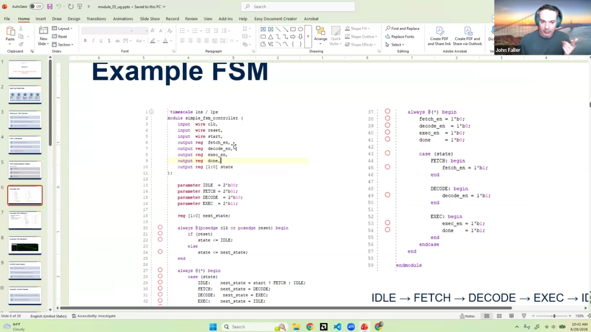
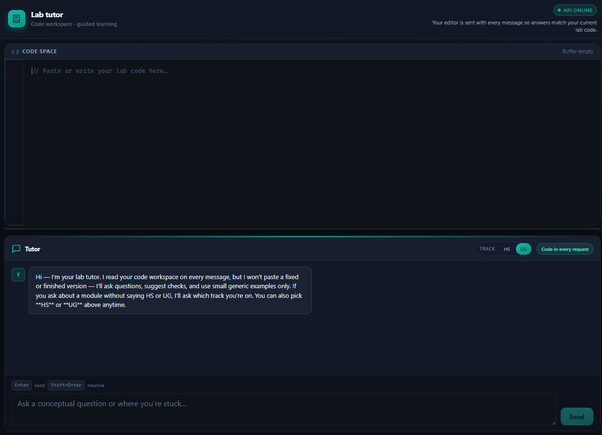
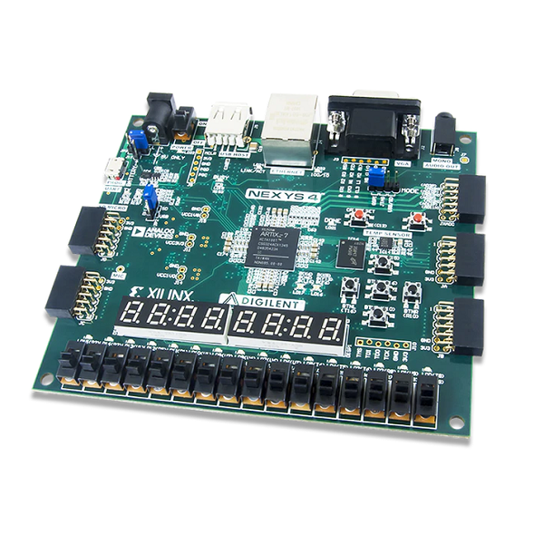
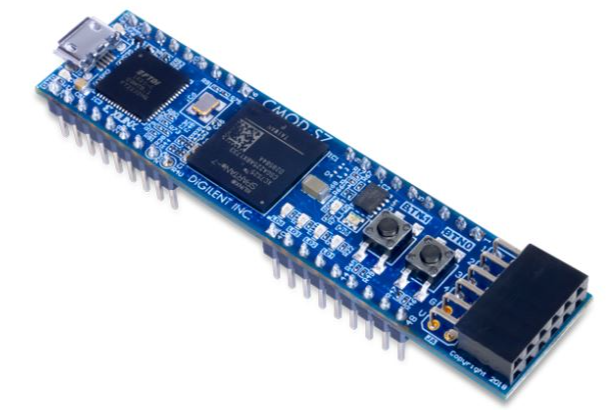
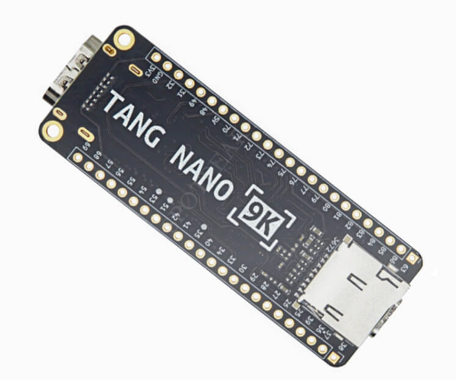
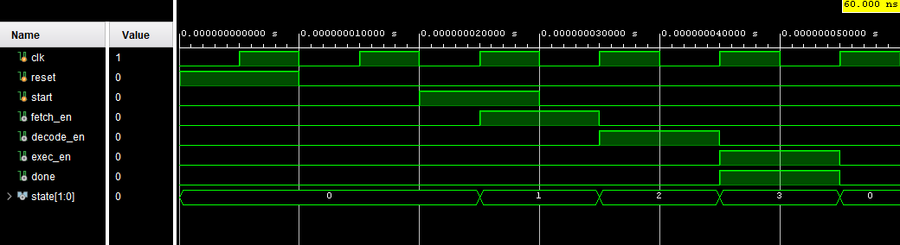

# Program Highlights

The CSUF Semiconductor Summer Program (SSP) combines open educational resources, hands-on FPGA development, AI-assisted learning, and industry-oriented instruction to introduce students to modern digital hardware design.

## Open Educational Resources (OER)

All instructional materials developed for SSP are released as Open Educational Resources (OER).

The curriculum includes:

* Lecture slides
* Guided worksheets
* Laboratory activities
* FPGA programming projects
* Instructor resources
* Example solutions

This allows students, instructors, and schools to freely use and adapt the materials.

**Repository**

[https://github.com/jfaller-csuf/csuf-ssp-oer](https://github.com/jfaller-csuf/csuf-ssp-oer)

---

## Video Lecture Series

Every lecture is recorded and made available through YouTube so students can learn at their own pace and review concepts outside of class.

Topics include:

* Digital logic
* Verilog
* Finite State Machines
* FPGA design
* Computer architecture
* Semiconductor careers
* Capstone projects

**YouTube Playlist**

[https://www.youtube.com/playlist?list=PLxYT_0WQMg35kcxnnfJpkdShYCf-Zy6qW](https://www.youtube.com/playlist?list=PLxYT_0WQMg35kcxnnfJpkdShYCf-Zy6qW)

---

## Hands-on FPGA Development

Students learn by programming real FPGA hardware rather than relying solely on simulation.

### CSUF Undergraduate Students

Each CSUF participant uses a

* **Digilent Nexys A7 FPGA Development Board**

The Nexys A7 provides a full-featured FPGA platform suitable for university-level digital design courses.

---

### High School Students

High school participants may complete labs using one of several affordable FPGA boards, including:

* Digilent **Cmod S7**
* **Tang Nano 9K**

These boards allow students to complete nearly all laboratory exercises from home.

---

## AI Tutor

SSP includes a custom AI Tutor developed specifically for the program.

Unlike traditional chatbots that simply provide complete solutions, the SSP AI Tutor emphasizes learning by:

* Asking guiding questions
* Providing hints
* Helping students debug code
* Explaining concepts
* Encouraging problem-solving

The tutor is integrated with the laboratory environment so students can receive context-aware assistance while completing activities.

---

## Project-Based Learning

Students build their digital design skills through a sequence of progressively more challenging projects, including:

* Combinational logic
* Sequential logic
* Finite State Machines (FSMs)
* Arithmetic circuits
* Simple processors
* FPGA-based system integration

Throughout the program, students apply engineering best practices for design, simulation, testing, debugging, and documentation.

As a culminating experience, students use the knowledge and skills developed throughout the program to design a digital circuit for fabrication through the [Tiny Tapeout](https://tinytapeout.com/) open-source ASIC program, providing exposure to the complete hardware design flow from RTL design to silicon.

---

## Preparing Students for Semiconductor Careers

Beyond technical skills, SSP introduces students to the broader semiconductor ecosystem through discussions of:

* Semiconductor manufacturing
* ASIC and FPGA design
* Embedded systems
* Computer architecture
* AI hardware
* Industry career pathways

Students finish the program with practical experience using industry-relevant design tools and hardware.

---

## Open and Reusable

One goal of SSP is to make high-quality semiconductor education widely accessible.

All curriculum materials are openly available so other instructors, schools, and outreach programs can build upon the work.

---

## Gallery

  

    
    

      <h3>Video Lectures</h3>
      

        Weekly live Zoom lectures are recorded and published on YouTube so
        students can review concepts anytime.
      

    

  

  

    
    

      <h3>AI Tutor</h3>
      

        A custom AI tutor provides hints, debugging guidance, and conceptual
        explanations without giving away complete solutions.
      

    

  

  

  
  

    <h3>Nexys A7 FPGA Board</h3>
    

      CSUF undergraduate students use the Digilent Nexys A7, a full-featured
      Xilinx Artix-7 FPGA development board that supports advanced digital
      logic, finite state machine, and processor design projects.
    

  

  
  

    <h3>Cmod S7</h3>
    

      High school students may complete laboratory activities using the
      Digilent Cmod S7, a compact breadboardable Spartan-7 FPGA module that
      provides an affordable platform for learning digital design at home.
    

  

  
  

    <h3>Tang Nano 9K</h3>
    

      As an alternative hardware option, the Tang Nano 9K offers a low-cost
      FPGA development platform featuring a Gowin FPGA, built-in USB
      programming, and support for the majority of SSP laboratory exercises.
    

  

  
  

    <h3>Student FPGA Projects</h3>
    

      Throughout the program, students design, implement, and test FPGA-based
      systems that reinforce concepts from lectures and laboratories while
      developing practical engineering and debugging skills.
    

  

